# Day 1 — Core Identity & Network Foundation

> **Objective:** Build the enterprise identity foundation by deploying Active Directory Domain Services, DNS, DHCP, and joining the first workstation to the domain.

---

# Lab Status

| Component | Status |
|-----------|--------|
| Active Directory | ✅ Completed |
| DNS | ✅ Completed |
| DHCP | ✅ Completed |
| Organizational Units | ✅ Completed |
| Users | ✅ Completed |
| Security Groups | ✅ Completed |
| Domain Join | ✅ Completed |
| Validation | ✅ Passed |

---

# Virtual Machines Used

| VM | Role |
|----|------|
| CAS-DC-01 | Windows Server 2022 - Primary Domain Controller |
| CAS-IT-WS1 | Windows 11 Enterprise Client |

Only these two virtual machines were powered on during Day 1 to follow the project's **Phased Dynamic Boot Strategy**.

---

# 1. Static Network Configuration

Before deploying Active Directory, CAS-DC-01 was configured with a static IPv4 address.

Configuration:

- IP Address: 192.168.10.10
- Subnet Mask: 255.255.255.0
- Default Gateway: 192.168.10.1
- Preferred DNS: 192.168.10.10

### Screenshot

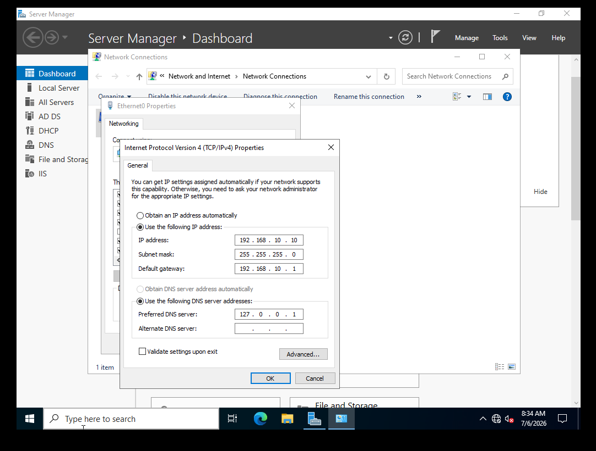

---

# 2. Active Directory Installation

The Active Directory Domain Services role was installed using **Server Manager**.

Following installation, the server was promoted as the first domain controller for the new forest.

Forest Name:

```
atlas.internal
```

### Screenshot

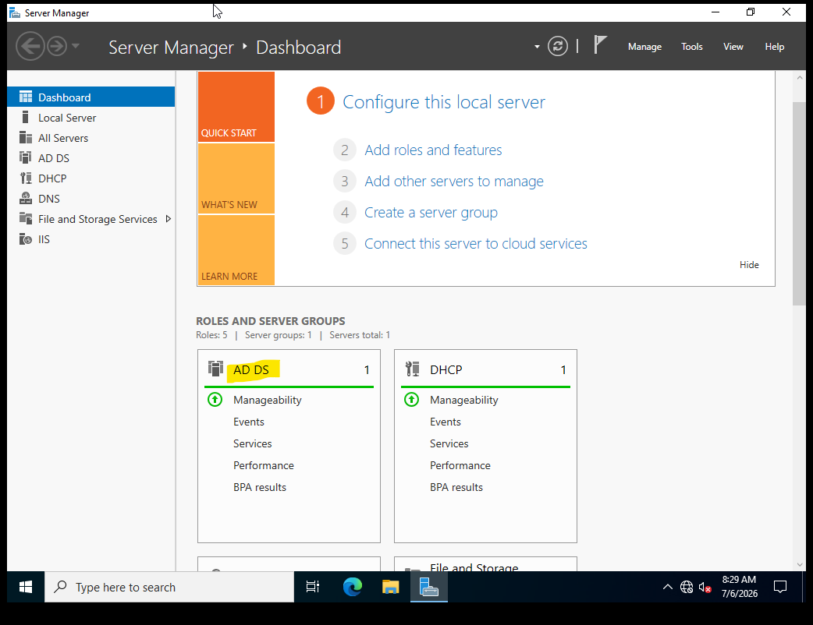

---

# 3. Domain Controller Promotion

CAS-DC-01 was promoted as the first Domain Controller.

Services deployed:

- Active Directory
- DNS
- Global Catalog

### Screenshot


---

# 4. Server Manager Verification

After rebooting, Server Manager confirmed all infrastructure roles were operational.

Installed Roles:

- Active Directory Domain Services
- DNS Server

### Screenshot

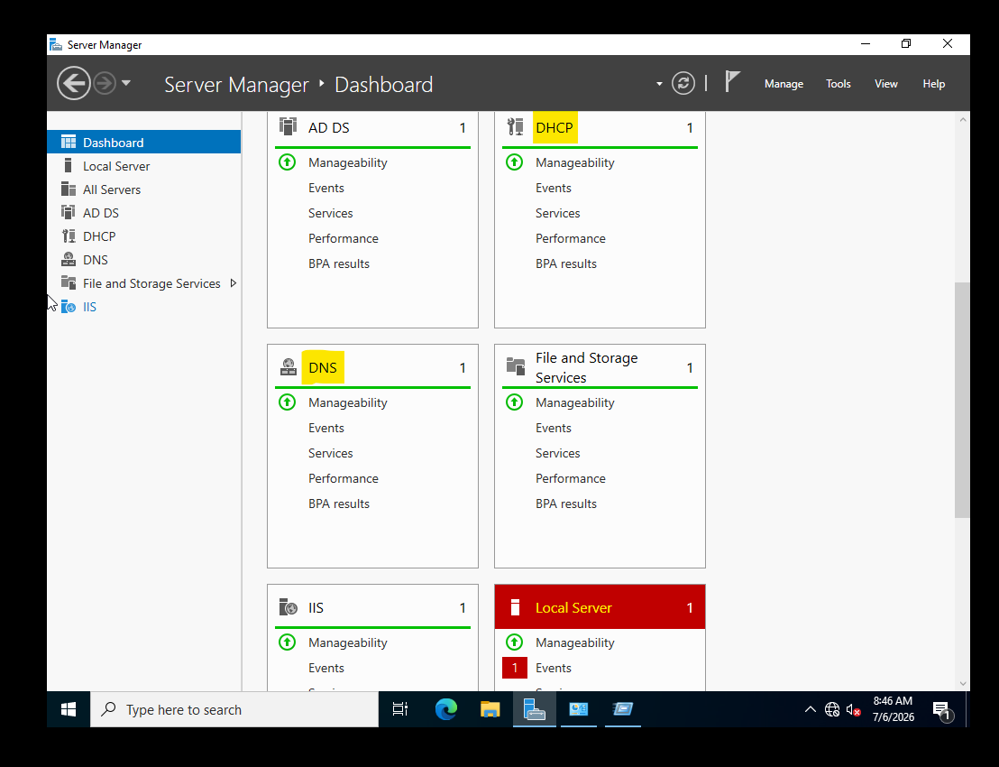

---

# 5. Organizational Unit Structure

The domain was organized using a hierarchical OU design.

```
atlas.internal

└── Atlas-Agency
    ├── CAS-Endpoints
    │   ├── Servers
    │   └── Workstations
    │
    ├── CAS-Groups
    │
    └── CAS-Staff
        ├── Operation
        └── Production
```

### Screenshot

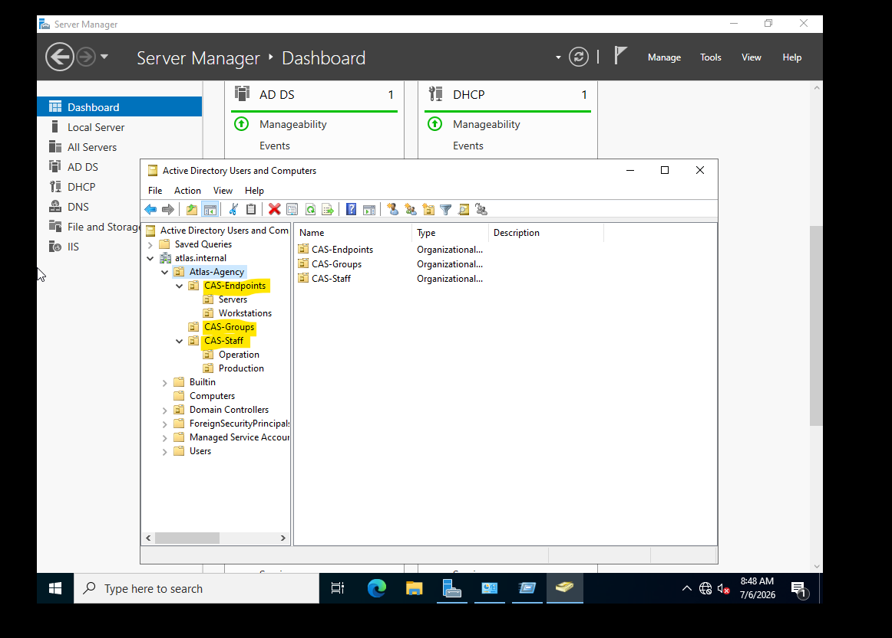

---

# 6. User Accounts

Departmental user accounts were created.

| Username | Department |
|-----------|------------|
| idrissi | Operation |
| meryem | Production |

### Screenshot

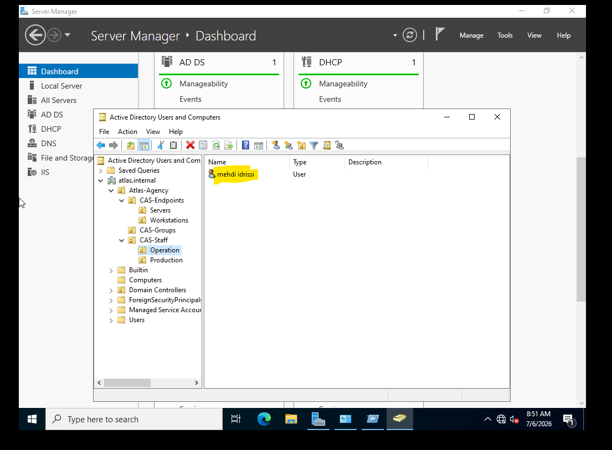

---

# 7. Security Groups

Role-based access groups were created.

- GS-Files-Creative-RW
- GS-Files-HR-Private
- GS-GMSA-Hosts

These groups will later be used for NTFS permissions and Group Policy targeting.

### Screenshot

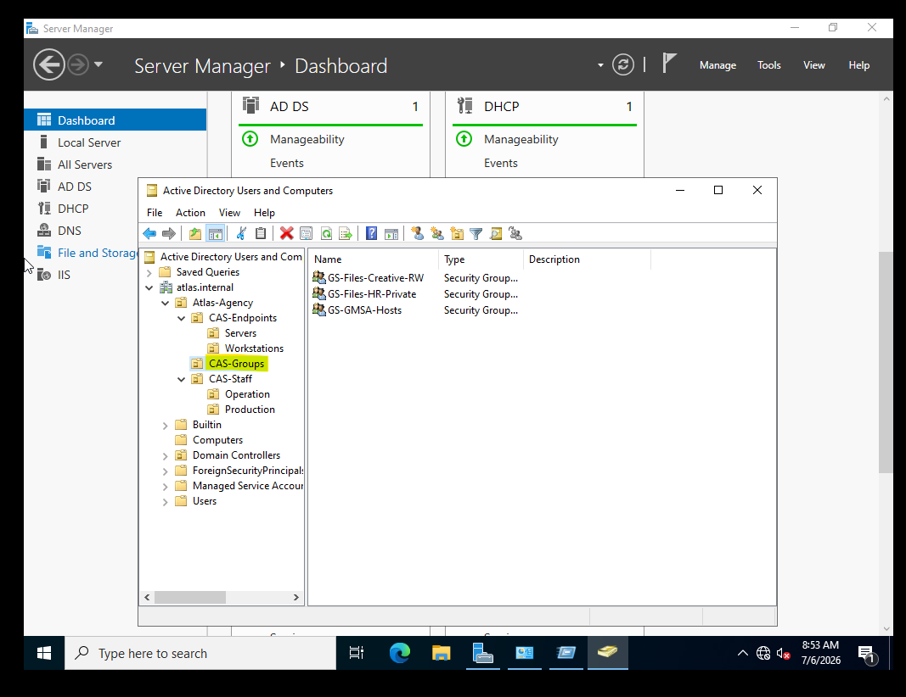

---

# 8. DNS Configuration

DNS Manager was configured with:

- Forward Lookup Zone
- Reverse Lookup Zones
- Host (A) Records
- Alias (CNAME) Records
- Forwarders

### Screenshot

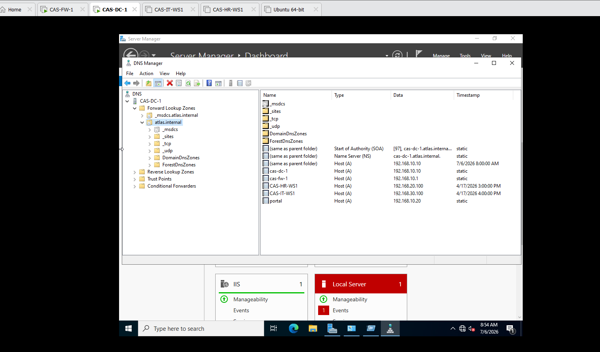

---

# 9. Reverse Lookup Zones

Reverse lookup zones were configured to support PTR record resolution.

### Screenshot

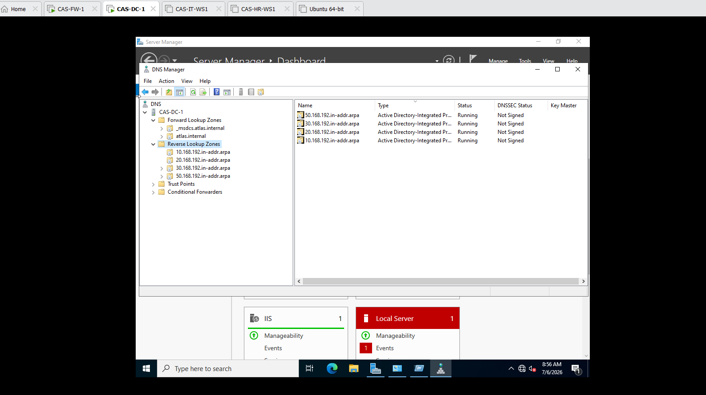

---

# 10. DHCP Configuration

DHCP scopes were configured for:

- VLAN 10
- VLAN 20
- VLAN 30

Each scope distributes:

- IP Address
- Gateway
- DNS Server

### Screenshot

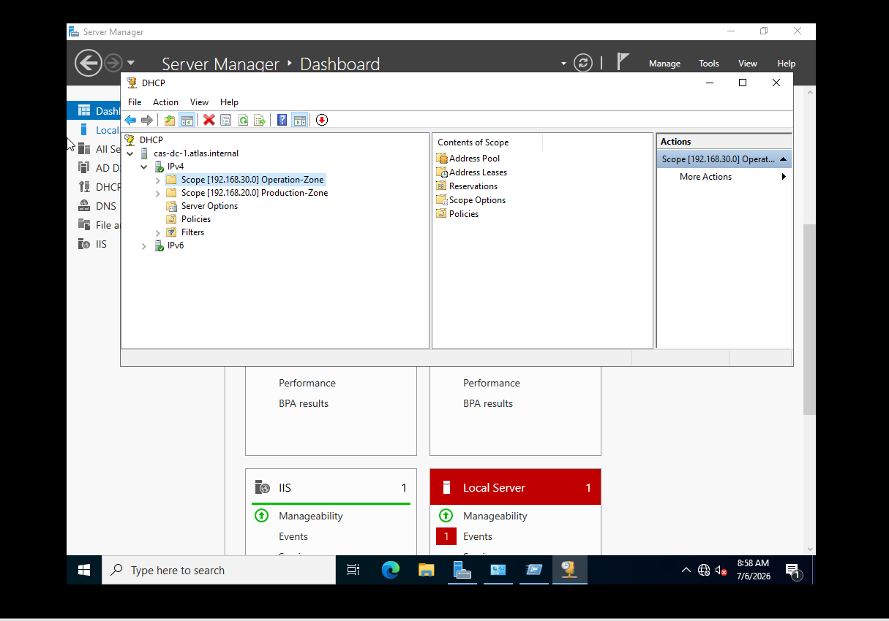

---

# 11. Domain Join

CAS-IT-WS1 successfully joined the domain.

Domain:

```
atlas.internal
```

### Screenshot

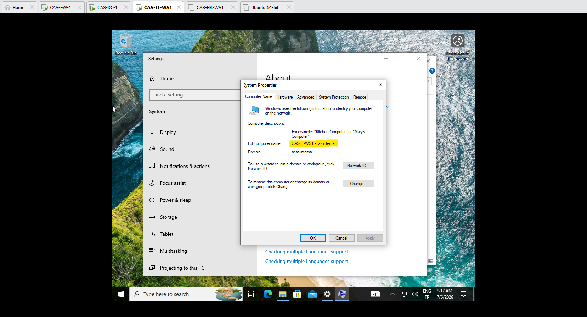

---

# 12. Network Verification

The client successfully obtained its configuration from DHCP.

Verification command:

```
ipconfig /all
```

### Screenshot

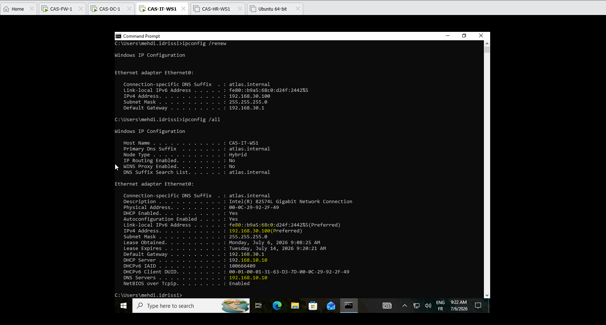

---

# 13. User Authentication

The workstation authenticated using the Active Directory domain.

Verification:

```
whoami
```

Expected Output:

```
atlas\idrissi
```

### Screenshot

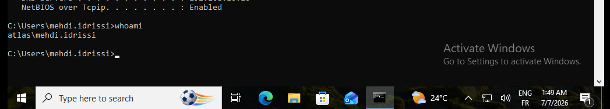

---

# 14. Group Policy Verification

Group Policy processing was verified.

Command:

```
gpresult /r
```

### Screenshot

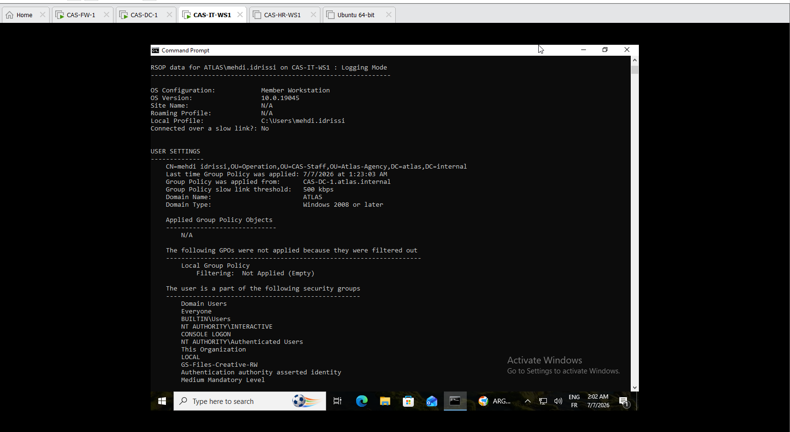

---

# 15. DNS Resolution

DNS resolution was validated.

Command:

```
nslookup atlas.internal
```

### Screenshot

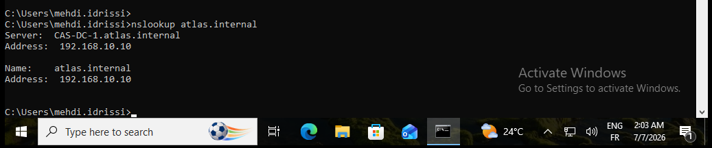

---

# 16. Connectivity Test

Network connectivity between the workstation and Domain Controller was confirmed.

Command:

```
ping cas-dc-01
```

### Screenshot

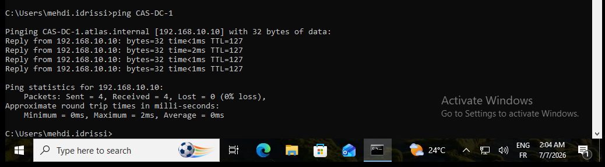

---

# Summary

## Infrastructure Delivered

- Active Directory Forest
- DNS Server
- DHCP Server
- Organizational Unit Hierarchy
- Departmental Users
- Security Groups
- Domain-Joined Client

---

## Validation Status

| Test | Result |
|------|--------|
| Domain Promotion | ✅ |
| DNS Resolution | ✅ |
| DHCP Lease | ✅ |
| Domain Join | ✅ |
| Authentication | ✅ |
| Connectivity | ✅ |

---

# Next Phase

**Day 2 — Centralized Policy Management**

Upcoming topics:

- Group Policy Objects (GPO)
- Password Policies
- DFS Namespace
- FSRM
- NTFS Permissions
- Access-Based Enumeration
- Drive Mapping
